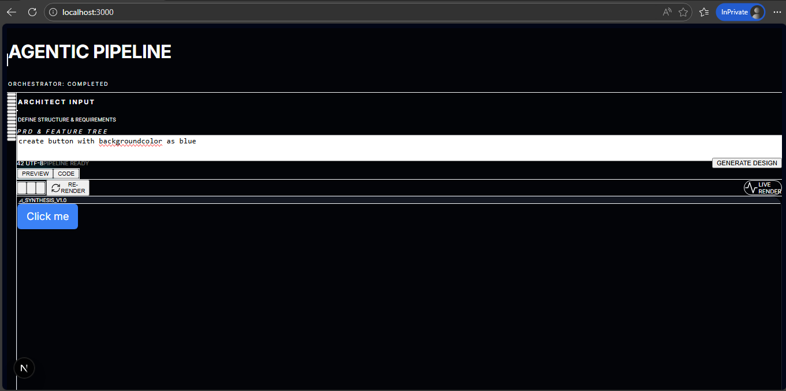

This is a [Next.js](https://nextjs.org) project bootstrapped with [`create-next-app`](https://nextjs.org/docs/app/api-reference/cli/create-next-app).

## Getting Started

First, run the development server:

```bash
npm run dev
# or
yarn dev
# or
pnpm dev
# or
bun dev
```

Open [http://localhost:3000](http://localhost:3000) with your browser to see the result.

## Screenshot



## Tech Stack

- `Next.js` (App Router + Route Handlers)
- `React 19` (client components)
- `TypeScript`
- `Tailwind CSS` (v4) for styling
- `@google/generative-ai` for Gemini model access + function/tool calling
- OpenAI-compatible tool calling for Groq/xAI (`/openai/v1/chat/completions` endpoints)
- `PrismJS` for code highlighting (Code tab)

## 2+1 Agent Pipeline (with Tool Calling + Memory)

This app turns your PRD into a single React/Tailwind component by running a 2+1 agent pipeline:

- **Orchestrator (1)**: decides when to call tools, coordinates execution, and finalizes the response via `submit_final_component`
- **Architect (2a)**: converts your PRD + session context into a UI spec (no code)
- **Developer (2b)**: converts the UI spec + session context into the final executable TSX component

### Memory (Session-Scoped)

- The browser generates a `sessionId` and stores it in `localStorage` (`ai_ui_session_id`)
- The server keeps TTL-based in-memory session memory (Map + expiry)
- Tools can only read/write via `memory_read` and `memory_write` (merge semantics for `summary`, `facts`, and `lastSpec`)

### Tool Calling

Server-side tool handlers are exposed to the model and executed in a loop until completion:

- `memory_read`
- `memory_write`
- `run_architect`
- `run_developer`
- `submit_final_component`

For streaming UI updates, `/api/generate/stream` sends SSE events:
- `trace` (each tool step)
- `done` (final TSX)
- `error` (failure reason)

You can start editing the page by modifying `app/page.tsx`. The page auto-updates as you edit the file.

This project uses [`next/font`](https://nextjs.org/docs/app/building-your-application/optimizing/fonts) to automatically optimize and load [Geist](https://vercel.com/font), a new font family for Vercel.

## Learn More

To learn more about Next.js, take a look at the following resources:

- [Next.js Documentation](https://nextjs.org/docs) - learn about Next.js features and API.
- [Learn Next.js](https://nextjs.org/learn) - an interactive Next.js tutorial.

You can check out [the Next.js GitHub repository](https://github.com/vercel/next.js) - your feedback and contributions are welcome!

## Deploy on Vercel

The easiest way to deploy your Next.js app is to use the [Vercel Platform](https://vercel.com/new?utm_medium=default-template&filter=next.js&utm_source=create-next-app&utm_campaign=create-next-app-readme) from the creators of Next.js.

Check out our [Next.js deployment documentation](https://nextjs.org/docs/app/building-your-application/deploying) for more details.
