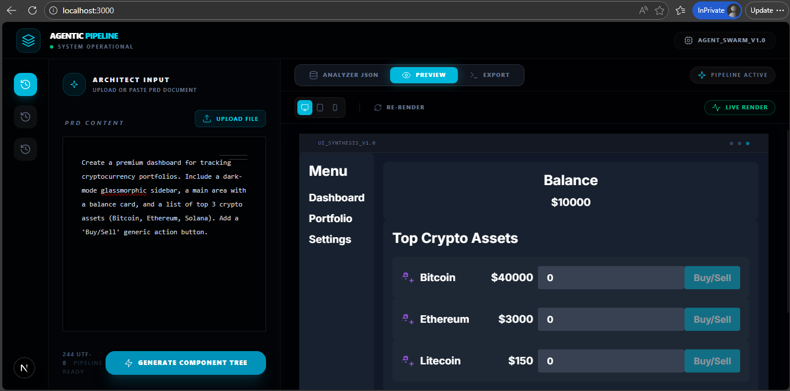
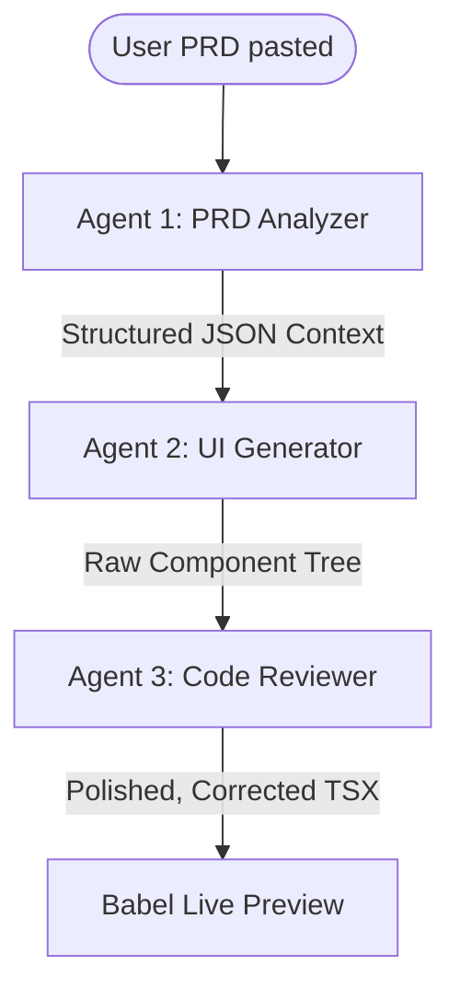

# 🌌 UI Generator + Agent Pipeline

A high-performance, distraction-free system for generating premium React components using an **AI-driven multi-agent pipeline**. The system evolves from a simple UI generator into a complete **linear agentic pipeline with specialized auditing**.



<video width="100%" controls poster="src/assets/DemoImg.png">
  <source src="SpecToUIAgent.mp4" type="video/mp4">
  Your browser does not support the video tag. [Watch Demo Video here](SpecToUIAgent.mp4)
</video>

---

# 🚀 Project Architecture

This application runs a robust pipeline consisting of three specialized AI Agents working sequentially to ensure a flawless final output. 

### 🤖 Multi-Agent Pipeline

- **Agent 1: PRD Analyzer**
  - Converts unstructured PRD (Product Requirements Document) → Structured JSON (pages, components, features).
  - Uses strictly formatted parsing layers to prepare context.

- **Agent 2: UI Generator**
  - Converts structured JSON → React + Tailwind UI code.
  - Dictates precise, premium "Dark Glassmorphism" styling.

- **Agent 3: Code Reviewer & Refiner**
  - Our newest audit layer. Checks the raw Component Tree produced by Agent 2 for:
    - Tailwind syntax errors
    - Accessibility concerns (aria labels, semantic HTML)
    - Code execution stability
  - Corrects bugs and automatically handles self-correction before rendering.

- **Agent 4: Data Schema Generator** 
  - Reads the PRD to synthesize database formats and state management schemas (e.g., Prisma models, JSON structures, API payloads) tailored specifically for the generated UI components.

---

### 🟢 Live Babel Previews
The UI integrates **Babel Standalone** to instantly compile and run the React output produced by Agent 3 directly in the browser's DOM, meaning you get interactive component previews with state correctly simulated—not just fake HTML dumps.

### 🧠 Memory System
- Stores:
  - Previous PRDs
  - Generated UI
  - Structured outputs
- Enables session tracking and prompt iterations.

---

### 🔄 Agentic Execution Flow



---

# 🛠 Tech Stack

| Layer | Technologies |
| :--- | :--- |
| **Frontend** | React, Next.js 15, Tailwind CSS |
| **Runtime** | Babel Standalone, React DOM |
| **AI Models** | Gemini 1.5 Pro / Groq (Llama 3.3) / Grok-beta |
| **Agent System** | Custom multi-agent sequential pipeline |
| **Tool Calling** | Simulated backend invocation pipelines |

---

# 🚀 Getting Started

### 1. Setup Environment

Create a `.env` file in the root:
```
NEXT_PUBLIC_GEMINI_API_KEY=your_key_here
```

### 2. Install

```
npm install
```

### 3. Run

```
npm run dev
```

---

# 📜 License

MIT License
