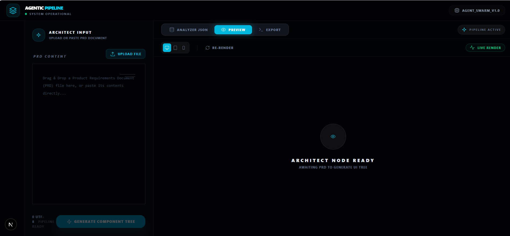
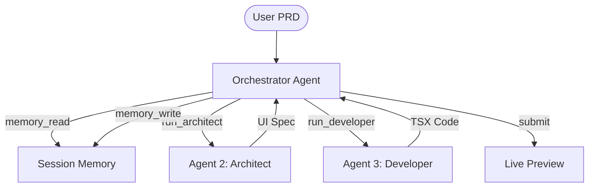
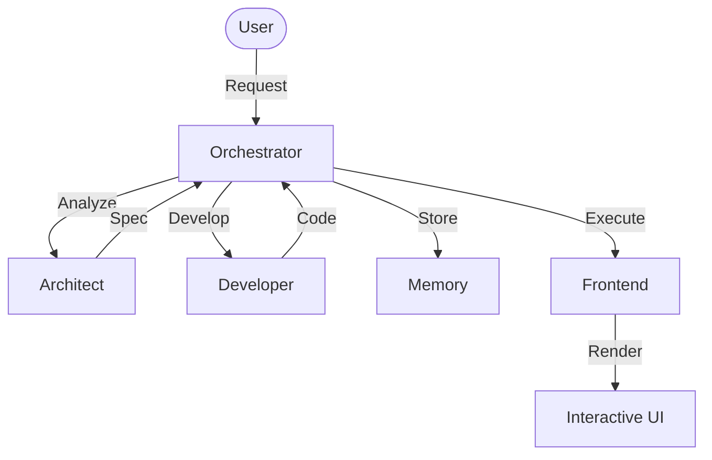

# 🌌 UI Generator + Agent Pipeline

A high-performance, distraction-free system for generating premium React components using an **AI-driven multi-agent pipeline**. The system evolves from a PRD-based UI generator into a complete **agentic architecture with memory, tool-calling, and multi-agent orchestration**.



<video width="100%" controls poster="src/assets/prototype.png">
  <source src="SpecToUIAgent.mp4" type="video/mp4">
  Your browser does not support the video tag. [Watch Demo Video here](SpecToUIAgent.mp4)
</video>

---

# 🚀 Project Phases

## 🟢 Phase 1 — UI Generator (Frontend Task)

Built a React/Next.js application where:

- User provides a **Product Requirements Document (PRD)**
- AI generates:
  - UI component tree
  - Tailwind-based React code
- Features:
  - Real-time preview using Babel
  - Code export
  - Multi-model LLM support
  - Design history

👉 This phase focuses on **PRD → UI generation**

---

## 🔵 Phase 2 — Agent Pipeline (Capstone)

Extended Phase 1 into a **complete agentic system** with:

### 🤖 Multi-Agent Architecture
- **Agent 1: PRD Analyzer**
  - Converts raw PRD → structured JSON (pages, components, features)
- **Agent 2: UI Generator**
  - Converts structured data → React + Tailwind UI

---

### 🔧 Tool Calling Layer
The Orchestrator autonomously invokes tools to manage worker agents and state:

- `memory_read()` / `memory_write()` — Persistent session context.
- `run_architect()` — Triggers Agent 2 to produce a UI spec.
- `run_developer()` — Triggers Agent 3 to synthesize TSX code.
- `submit_final_component()` — Validates and returns the final product.

---

### 🧠 Memory System
- Stores:
  - Previous PRDs
  - Generated UI
  - Structured outputs
- Enables:
  - reuse
  - iteration
  - history tracking

---

### 🔄 Agentic Execution Flow



---

# ✨ Features

- **🚀 Real-time UI Generation**
- **🤖 Multi-Agent Pipeline (Analyzer + Generator)**
- **🧠 Memory Persistence**
- **🔧 Tool Calling Architecture**
- **💎 Premium UI Rendering**
- **🛠 Code Preview + Export**
- **📦 PRD → Structured → UI Flow**

---

# 🏗 Architecture

The system uses a **hybrid execution model**:

- Server: LLM + agent orchestration  
- Client: UI rendering + preview  



---

# 🛠 Tech Stack

| Layer | Technologies |
| :--- | :--- |
| **Frontend** | React, Next.js 15, Tailwind CSS |
| **Runtime** | Babel Standalone |
| **AI Models** | Gemini / Groq / Grok |
| **Agent System** | Custom multi-agent logic |
| **Memory** | Local storage / JSON |

---

# 🚀 Getting Started

### 1. Setup Environment

```
NEXT_PUBLIC_GEMINI_API_KEY=your_key_here
```

---

### 2. Install

```
npm install
```

---

### 3. Run

```
npm run dev
```

---

# 🎯 Key Concept

This project demonstrates:

> Transition from a **single AI feature** → **complete agentic system**


---

# 📜 License

MIT License
